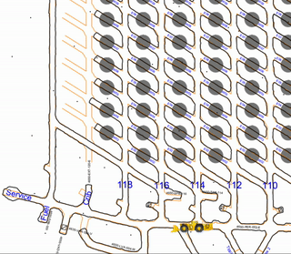

# RoxOff

Rox on, Rox off - the Adaptive Driver Performance Training for bogger drivers
in Newcrest Cadia mines. A repo of our analysis of Bogger (loader) data and how
to improve efficiency.

The full presentation (with animated gifs) is on [Google
Drive](https://docs.google.com/presentation/d/1t8xp-ZhLitig8ZFk0dklbqFQOs10YW87eYzybUEqRdM/edit?usp=sharing)

A static version is available from this repository as pdf [RoxOff.pdf](./RoxOff.pdf)

## Final findings

This is still work in progress.

## What next

Now that the competition is over I want to consolidate my learnings in a set of
techniques and technologies. Ultimately I want this to become a review of what
we did and a getting started point on the next data based hackathon. I will
update [ANALYSIS_OVERVIEW.md](./ANALYSIS_OVERVIEW.md)

